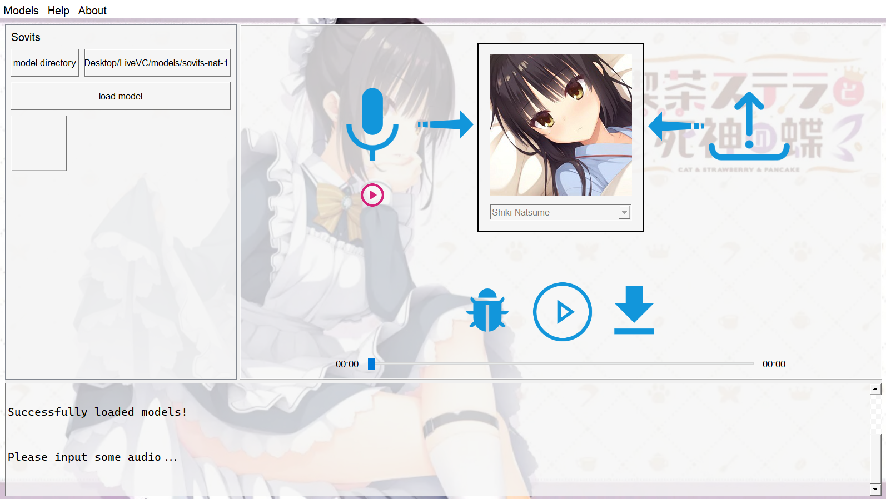
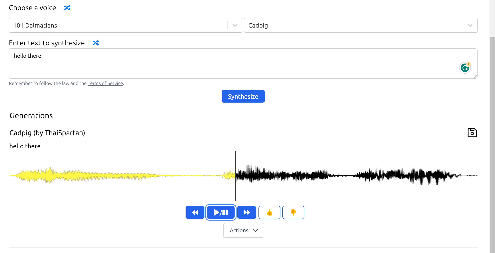

# 后端接口说明

## 一、语音转换：Sovits

### 任务描述

语音转换（voice conversion）的任务是将一段**源语音**（source speech）通过模型转换到**目标语音**（target speech），使得目标语音具有目标语者（target speaker）的特点（音色、音调等）的同时，保留源语音中的内容。

对于本项目，用户可以上传一段（源）语音，选择目标语者身份（speaker identity），然后点击转换按钮将源语音转换到目标语音。软件还应允许用户播放和下载转换后的语音。

### 接口描述

模块需变量、函数均集成在`sovits/inference.py`中。代码主要包括了若干全局变量、模型类、辅助函数和主函数`voice_conversion()`。其中，全局变量和辅助函数用于阻塞主函数，等待用户的某些操作（如上传音频）。前端主要就是调用它们。

全局变量表：

| 全局变量       | 说明                                                         |
| -------------- | ------------------------------------------------------------ |
| source_path    | 用户上传源语音的路径。                                       |
| export_path    | 上传后的语音经过格式转换（如`.mp3`转成`.wav`后的导出路径。之后的语音转换用的也是该导出音频。 |
| flag_upload    | 用户是否上传了音频。                                         |
| flag_convert   | 用户是否开始转换。                                           |
| flag_terminate | 用户是否结束语音转换。                                       |
| sid_source     | 源语者的id（实际上没有用到）。                               |
| sid_target     | 目标语者的id。                                               |
| device         | 允许设备（默认为CPU）。                                      |
| NOISE_SCALE    | 语音情感参数1（介于0.0至1.0，需要前端给出接口让用户调整）。  |
| NOISE_SCALE_W  | 语音情感参数2（介于0.0至1.0，需要前端给出接口让用户调整）。  |
| LENGTH_SCALE   | 语速（介于0.0至1.0，需要前端给出接口让用户调整）。           |

函数表：

| 函数             | 说明                                                         |
| ---------------- | ------------------------------------------------------------ |
| wait_upload      | 用于阻塞主函数。当用户上传音频后flag_upload变为真并结束阻塞。 |
| load_audio       | 让用户输入上传音频的路径audio_path，用于修改flag_upload为真来结束wait_upload的阻塞。au |
| wait_convert     | 用于阻塞主函数。当用户点击开始转换按钮后flag_convert变为真并结束阻塞。 |
| convert_audio    | 让用户开启语音转换，用于修改flag_convert为真来结束wait_convert的阻塞。同时，还会修改flag_upload为真，这是考虑到用户可能对同一条音频多次转换。 |
| select_speaker   | 让用户输入目标语者的身份speaker_id，并将其转换为tensor类型赋予sid_target变量。 |
| terminate_vc     | 让用户能够结束语音转换，用于修改flag_terminate为真来跳出主函数的while循环。 |
| voice_conversion | 语音转换主函数。它接收用户输入的模型文件夹路径model_dir并加载模型和配置文件，然后进入while循环等待用户上传音频和开启转换。 |

### 界面

一个参考界面如下。

界面需要控件包括：

- 模型文件夹输入框；
- 开始加载模型按钮；
- 上传音频按钮；
- 开启转换按钮；
- 播放音频按钮；
- 下载音频按钮。

在此基础上，参考接口描述，还可以增加：

- 语音情感参数控制条；
- 语速控制条；
- 信息窗口（类似IDE的终端，用于提示用户）。

## 二、语音合成：VITS

### 任务描述

语音合成（speech synthesis）的任务是将文本转换成语音。即输入一段文本，输出一段语音，使得听者能够理解文本内容并获取相关信息。

用户可以输入待转换的文本，点击合成按钮，就可以得到对应的语音输出。同时，用户也可以播放和下载合成后的语音。

### 接口描述

在`vits/_tts.py`中，直接运行该代码可以播放合成的语音，该代码模块的主要类是VitsWrapper，VitsWrapper类是基于VitsInfer API的语音处理工具。在这个类中，有一些方法可以将字符串转换为语音。其中，generate_audio_slow()和generate_audio_fast()方法可以分别以正常推理和多线程推理的方式生成语音，并使用PlaySound库播放生成的音频文件。

变量表：

| 变量名            | 说明                                 |
| ----------------- | ------------------------------------ |
| vits_backend_path | 存储`vits_backend`文件夹路径的变量。 |
| my_string         | 存储需要合成的文本                   |

函数表：

| 函数名                           | 说明                                                         |
| -------------------------------- | ------------------------------------------------------------ |
| TTS()                            | TTS类的构造函数。它负责创建语音合成进程池、初始化进程锁条件、语音合成队列等。 |
| tts_worker(text_data)            | TTS多进程合成音频的函数。                                    |
| play_sound_0(filenames)          | 顺序播放多进程生成的音频文件，用于展示音频生成的顺序。       |
| play_sound_1(filenames)          | 顺序播放多进程生成的音频文件，使用`pygame`模块播放。         |
| VitsWrapper()                    | VitsWrapper类的构造函数，主要负责加载`VitsInfer`模型并初始化一些变量。 |
| generate_audio_slow(item)        | 使用单进程生成音频并播放出来。                               |
| generate_audio_thread(text_data) | TTS多线程合成音频的函数。                                    |
| generate_audio_fast(new_string)  | 使用多线程并发合成`new_string`中的句子。合成完毕后使用`sounddevice`模块播放音频。 |

### 界面

一个参考界面如下。

## 三、语音增强：CleanUNet

### 任务描述

语音增强（speech enhancement）的任务是将一段带噪语音通过模型转换成干净语音，即去除背景噪声，保留人声。

与语音转换类似，用户可以上传一段带噪语音，点击降噪（denoise）按钮就可以得到干净语音。同时，用户可以播放和下载降噪后的语音。

### 接口描述

模块需变量、函数均集成在`cleanunet/inference.py`中。代码主要包括了若干全局变量、模型类、辅助函数和主函数`denoising()`。其中，全局变量和辅助函数用于阻塞主函数，等待用户的某些操作（如上传音频）。前端主要就是调用它们。

变量和函数的风格及作用同**Sovits**模块。

### 界面

与**Sovits**类似，界面需要控件包括：

- 模型文件夹输入框；
- 开始加载模型按钮；
- 上传音频按钮；
- 开启降噪按钮；
- 播放音频按钮；
- 下载音频按钮。

## 四、图像超分：SwinIR

###  任务描述

图像超分（image super resolution）的任务是将一张低分辨率的图片通过模型转换成一张高分辨率的图片。

本项目中，用户可以上传一张模糊的图片，点击超分按钮，得到一张清晰的图片。

### 接口描述

模块需变量、函数均集成在`swinir/inference.py`中。代码主要包括了若干全局变量、模型类、辅助函数和主函数`super_resolution()`。其中，全局变量和辅助函数用于阻塞主函数，等待用户的某些操作（如上传图片）。前端主要就是调用它们。

变量和函数的风格及作用同**Sovits**模块。

### 界面

与**Sovits**类似，界面需要控件包括：

- 模型文件夹输入框；
- 开始加载模型按钮；
- 上传图片按钮；
- 开启超分按钮；
- 展示超分后图片的展示框；
- 下载图片按钮。
