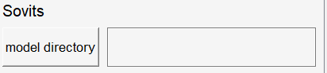
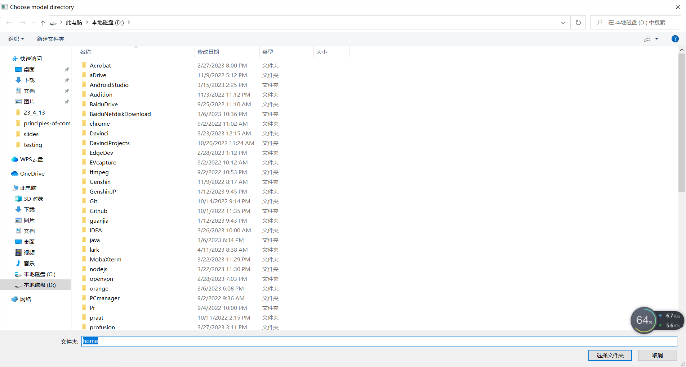
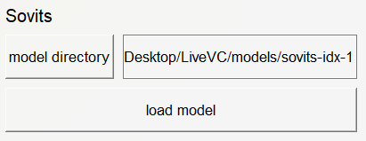
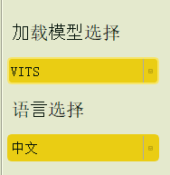
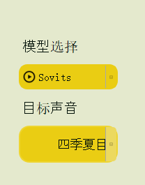

# Feedback-02

## 整体

### 一个参考:rocket:

[这里](https://github.com/Francis-Komizu/StellaVoiceChanger/releases/tag/v1.0.0)是一个与lemon4有类似功能的应用，建议体验一下功能，这样可以更清晰地知道具体需要哪些控件和更好地了解下面反馈地内容。

### 信息栏:fire:

可以加入一个信息栏用于提示用户操作和给予反馈。例如告知用户“模型加载成功”、“语音转换成功”等等。

### 模型加载按钮:boom:

需要加入选择模型路径按钮和加载模型按钮。

如下图，需要一个**选择模型路径按钮**让用户选择本地下载的模型。

用户点击`model directory`按钮后，需要弹出文件对话框。

选择完模型路径后，用户按下**加载模型按钮**开始加载模型，并输出信息提示用户正在加载。同样，加载完成后也需要提示信息。

## 文本转语音

- **加载模型选择下拉框**需要改成在**整体**中描述的**模型加载按钮**。
- 因为对于一个给定的模型，其能够合成语音的语言是确定的（例如派蒙模型只支持中文），所以不需要语言选择下拉框。需要将他改成一个label，来显示模型支持哪个语言。

## 语音转换

- 同**文本转语音**中的问题，**模型选择下拉框**改成模型加载按钮。
- **目标声音选择下拉框**不需要写死，而是根据模型相应的配置文件来自动生成支持目标声音的列表。模型的配置文件中会包含语者信息，如下图中的`speakers`所示。

## 语音降噪

- 缺少**加载模型按钮**。

