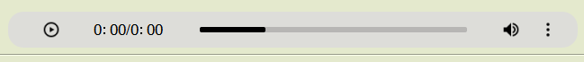
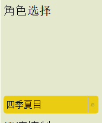
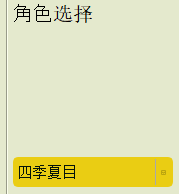
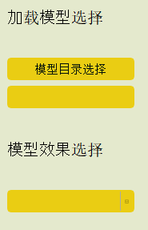
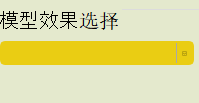

# Feedback-03

## 整体

### 播放语音

播放的进度条应当是可以拖动的。具体实现可以参考StellaVoiceChanger。

## 文本转语音

### 说话人选择

在加载模型之前不应选择说话人。此外**角色选择**的label和选择栏相距太远。

## 语音转换

### 说话人选择

在加载模型之前不应选择说话人。此外**角色选择**的label和选择栏相距太远。

### 进度条

单条语音在转换时不太好跟踪其进度，因此可以不需要这个进度条。

## 降噪

### 模型加载

**模型加载按钮**没有文字提示。**模型效果选择**指的是什么？应该不需要。

## 图像修复

### 模型加载

**模型效果选择**应该不需要。

