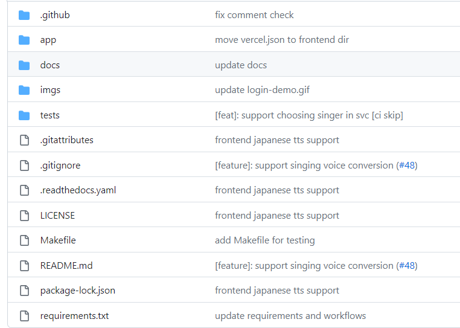
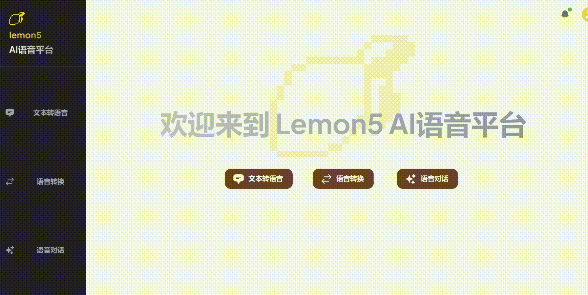

## Lemon 5

### 第一轮迭代报告

#### 1、项目概述

**1.1 项目背景**

智能语音包括语音识别、语音转换、自然语言处理等多个板块，该领域已经经历了认知阶段、起步阶段及发展应用阶段。2020年受疫情影响，智能语音系统应用需求激增，智能语音从需求出发，快速步入全新的技术融合阶段，整合多模式识别、大数据、物联网、云服务等技术，形成综合技术解决方案。智能语音应用前景旷阔，使用方便，因此我们团队拟开发一款名为Lemon5的大型智能语音软件，拥抱AI新时代的风口。

**1.2 方案实施**

整体项目我们拟实现为Web应用，前端使用react，后端使用Python Flask框架，实现文本转语音、语音转换以及智能对话功能。为了更加直观地展现功能，我们选取了知名的游戏“原神”作为语音语料库，让整体功能的展示更加清晰直观生动。

#### 2、迭代目标

**2.1 目标**

在第一轮迭代中，我们拟完成基本Web界面搭建，UI构建以及实现文本转语音功能。希望在一轮迭代时已经可以让项目初具规模。

**2.2 具体功能**

Web 端：实现前后端交互，完成API调用以及数据传递转换。

文本转语音：用户可以把文本转换成目标语音，得到不同发声者音频。

**2.3 实施方式**

我们将利用git工具完成多人协同开发，大家按照各自分工完成对应板块，再同一整合起来。我们IDE用的是Pycharm, 并使用sonarcube进行软件健壮性分析与错误排查。

#### 3、实现过程

我们首先在本地部署了自己的TTS模型并进行了多轮训练，但是发现由于训练数据太少，训练结果稍微欠一点火候。于是考虑利用现成的原神TTS api，其在本地测试时具有较好效果，能够以几乎贴近原声的方式输出目标语音。

在完成前后端交互以及api调用格式处理后，我们实现了本轮迭代全部目标。

#### 4、实现结果

项目架构

我们的页面如下所示：

可以看到文本转语音页面：

最后测试结果相对令人满意。